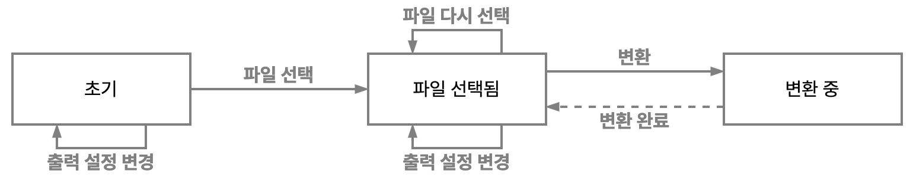

# gencg-exported-image-group

> 처리가 더 빠르면서 다양한 이미지 포맷을 지원하는 ‘[img-seq-pack](https://yejunian.github.io/img-seq-pack/)’을 사용하세요!
>
> - 사용해 보기: [https://yejunian.github.io/img-seq-pack/](https://yejunian.github.io/img-seq-pack/)
> - Repository: [https://github.com/yejunian/img-seq-pack](https://github.com/yejunian/img-seq-pack)

---

Convert TGA files exported by GenCG, a character generator for broadcasting system, to single PDF file (Korean only supported)

방송용 문자발생기 GenCG에서 내보낸 TGA 파일을 단일 PDF 파일로 변환합니다. (한국어만 지원)

[https://yejunian.github.io/gencg-exported-image-group/](https://yejunian.github.io/gencg-exported-image-group/)

---

## 사용법

### 0. GenCG에서 TGA로 이미지 내보내기

1. **‘파일 - 그림으로 저장’** 메뉴(단축키 Alt+Shift+S)
2. 범위 지정 후 ‘OK’
   - **All**: 전체 범위
   - **Current Page**: 현재 페이지만
   - **Pages**: ‘Start Page’부터 ‘End Page’까지
3. ‘저장 위치’ 및 ‘파일 이름’(접두어) 지정
   - **저장 위치**: 프로그램이 별도의 하위 폴더를 만들어 주지 않고, ‘저장 위치’에 표시된 디렉터리에 그대로 이미지를 저장한다는 점에 주의하여 지정합니다.
   - **파일 이름**: 저장되는 이미지 파일의 접두어를 지정합니다. 파일 이름을 `파일명`으로 주었을 때 실제로 저장되는 파일 이름은 `파일명xxxxx.tga` 형태입니다.
   - **파일 형식**: 저장할 이미지 형식을 지정합니다. 여기서는 **TGA** 형식으로 지정합니다. (1920x1080, 32비트 기준으로 130페이지에 1GB 정도 나옵니다.)
4. 저장이 완료될 때까지 기다립니다. 페이지 수가 많으면 저장하는 데 수 초에서 수십 초까지도 걸릴 수 있습니다. 완료되면 별도의 메시지 없이, 프로그램 제목의 ‘응답 없음’ 상태가 풀리고 GenCG 프로그램 내에서 다른 동작을 수행할 수 있게 됩니다.

### 1. 이미지 파일 선택

[GenCG HD에서 추출한 이미지 PDF로 묶기](https://yejunian.github.io/gencg-exported-image-group/) 페이지를 열고, 파일 선택 폼에서 앞서 저장한 TGA 파일을 모두 선택합니다. 파일을 어떤 순서로 선택하든지 파일명 순으로 처리됩니다. 파일을 다시 선택하면 이전에 선택한 파일 대신 새로 선택한 파일만 남습니다.

### 2. 출력 설정

결과물로 받을 PDF 설정을 변경합니다.

- **파일명**: 출력할 결과물의 파일명입니다. 기본값은 `generated.pdf`입니다.
- **PDF 크기**: 픽셀 단위로 입력합니다. 기본값은 960x540입니다.
- **배경색**: PDF 파일과 이미지의 배경색을 지정합니다. 기본값은 `#5e5e5e`입니다.
- **페이지 번호 표시**: 각 페이지에 페이지 번호를 표시합니다. 파일명에 관계없이 첫 파일이 1페이지입니다. 기본값은 ‘체크됨’입니다.

### 3. PDF 생성

선택한 이미지 파일과 설정을 토대로 PDF 파일을 생성합니다. 일반적으로 웹 브라우저에서 지정한 다운로드 폴더에, 지정한 파일명으로 저장됩니다. PDF 생성 완료 후에는 쾌적한 기기 사용을 위해 탭을 닫는 것을 권장합니다. 전원으로 배터리를 사용하는 경우 배터리 소모가 많을 수 있습니다.

3가지 환경에서 파일 로드부터 PDF 생성까지 걸리는 시간을 측정했을 때, 그 결과는 다음과 같았습니다. 시간 측정에 사용한 데이터는 1920x1080 크기의 무압축 32비트 TGA 파일 137개입니다.

- MacBook Pro 13" 2021 (M1, 16GB RAM): 50초
- MacBook Pro 15" 2019 (Intel i9 9980H, 16GB RAM): 62초
- Windows 데스크톱 (Intel i3 6100, 8GB RAM, SATA3 SSD): 70초

---

## 작동 방식

### 사용자 입장에서의 작동 흐름

- TGA 파일을 PDF로 변환 중인 상태가 아니라면, 언제든지 파일을 (다시) 선택하거나 출력 설정을 변경할 수 있습니다.
- 파일을 선택한 상태에서 ‘PDF 생성’ 버튼을 클릭하면 선택한 TGA 이미지를 PDF로 변환 중인 상태가 됩니다. 이 상태에서는 파일을 다시 선택하거나 출력 설정을 변경할 수 없습니다.
- TGA → PDF 변환 작업을 완료하여 PDF 파일을 저장하고 나면, 다시 파일을 선택하거나 출력 설정을 변경할 수 있는 상태로 돌아옵니다.

### 파일 선택

- 두 가지 방법으로 TGA 파일을 선택할 수 있습니다.
  1. Drag and drop을 이용한 선택: 넘겨받는 파일 중 `*.tga` 파일만 걸러냅니다.
  2. `<input type="file">`을 통한 선택: `*.tga` 파일만 선택할 수 있도록 제한이 걸려 있습니다.
- 파일을 선택하면, 선택한 파일들을 이름의 오름차순으로 정렬합니다. 이 순서대로 ‘선택된 파일’ 상태를 업데이트합니다.

### PDF 생성 과정

- PDF 생성 명령이 들어오면 파일 목록이나 설정이 꼬이는 것을 방지하기 위해 UI를 잠급니다. 작업이 끝나고 나면 UI 잠금을 해제합니다.
- PDF 문서는 [jspdf](https://www.npmjs.com/package/jspdf)를 활용하여 생성합니다. 그 과정은 다음과 같습니다.
  1. 모든 이미지를 PDF에 그릴 때까지 다음 작업을 반복합니다.
     1. PDF 문서 초기화
     2. 새 페이지에 들어갈 이미지 변환 (TGA to PNG/JPEG)
     3. PDF 문서에 새 페이지 추가
     4. 추가한 페이지에 배경, 이미지, 페이지 번호 그리기
  2. PDF 파일 저장
- 이미지 변환은 [tga-js](https://www.npmjs.com/package/tga-js), [browser-image-compression](https://www.npmjs.com/package/browser-image-compression), HTML Canvas를 활용하여 진행합니다. 그 과정은 다음과 같습니다.
  1. TGA 파일을 `ArrayBuffer`로 로드합니다. 이 `ArrayBuffer`를 `Uint8Array`로 변환합니다.
  2. tga-js를 이용하여, TGA 파일의 raw 데이터를 담은 `Uint8Array`를 `ImageData`로 변환합니다.
  3. HTML Canvas 엘리먼트를 생성하고, 배경색과 앞서 얻은 `ImageData`를 Canvas에 그립니다.
  4. browser-image-compression으로 이 Canvas의 크기를 축소하면서 PNG와 JPEG으로 압축합니다.
  5. PNG와 JPEG 중 더 나은 쪽을 선택합니다.
